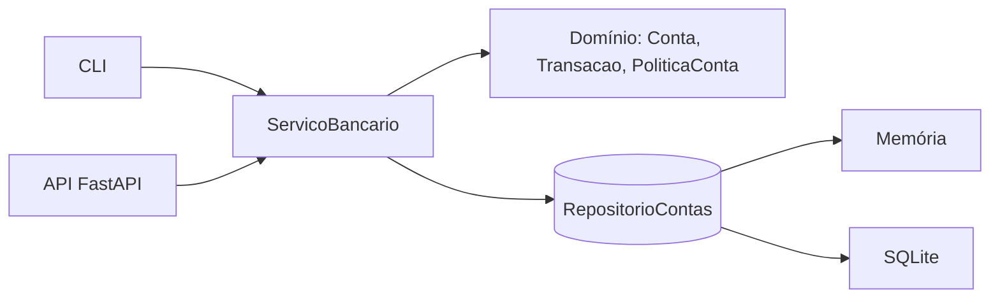

<h1 align="center">🏦 Sistema Bancário em Python</h1>

<p align="center">
  Depósito, saque e extrato com foco em backend: domínio testável, persistência plugável,<br>
  API REST com FastAPI e CLI sobre o mesmo núcleo.
</p>

<p align="center">
  
  
  
  
  
</p>

## 📑 Sumário

- [Sobre o projeto](#-sobre-o-projeto)
- [Funcionalidades](#-funcionalidades)
- [Regras de negócio](#-regras-de-negócio)
- [Arquitetura](#-arquitetura)
- [Como executar](#-como-executar)
- [API REST](#-api-rest)
- [Testes](#-testes)
- [Próximos passos](#-próximos-passos)

## 💡 Sobre o projeto

Projeto do desafio de Python da [DIO](https://www.dio.me/): um sistema bancário com as operações essenciais de **depósito**, **saque** e **extrato**, para um banco que busca monetizar suas operações.

Além do escopo básico, o foco foi construir algo próximo do que se espera de um backend real: dinheiro tratado com `Decimal`, regras isoladas do framework, erros tipados, proteção contra condição de corrida e testes automatizados.

## ✨ Funcionalidades

- Abertura de conta com número sequencial e nome do titular
- Depósito de valores positivos
- Saque com limite por operação, limite diário e tarifa opcional
- Extrato com saldo, data/hora de cada movimentação e filtro por tipo
- Persistência em **SQLite** (arquivo) ou em **memória** (testes)
- Duas interfaces sobre o mesmo núcleo: **API REST** e **CLI**

## 📏 Regras de negócio

| Regra | Padrão | Onde configurar |
|---|---|---|
| Valores devem ser **maiores que zero**, com no máximo **2 casas decimais** | — | `dominio/dinheiro.py` |
| Limite por saque | R$ 500,00 | `PoliticaConta.limite_por_saque` |
| Máximo de saques por dia | 3 | `PoliticaConta.limite_saques_diarios` |
| **Tarifa por saque** (monetização do banco) | R$ 0,00 | `PoliticaConta.tarifa_saque` |
| Saque não deixa a conta negativa (valor + tarifa ≤ saldo) | — | `Conta.sacar` |

Exemplo cobrando R$ 2,50 por saque:

```python
from decimal import Decimal
from banco.dominio import PoliticaConta
from banco.servicos import ServicoBancario

servico = ServicoBancario(repositorio, PoliticaConta(tarifa_saque=Decimal("2.50")))
```

## 🧱 Arquitetura



```
src/banco/
├── dominio/         # regras de negócio puras (sem I/O, sem framework)
├── repositorios/    # contrato (Protocol) + implementações Memória e SQLite
├── servicos/        # casos de uso, com lock contra condição de corrida
├── api/             # FastAPI: rotas, schemas e tratamento de erros
├── apresentacao.py  # formatação do extrato para a CLI
└── cli.py           # menu interativo
tests/               # domínio, serviço, API e CLI
```

### Decisões de projeto

| Decisão | Motivo |
|---|---|
| `Decimal` em vez de `float` | `0.1 + 0.2 != 0.3`; valores com mais de 2 casas são rejeitados, nunca arredondados em silêncio |
| Validar antes de alterar | Uma operação recusada não deixa rastro no saldo nem no extrato |
| Domínio separado da infraestrutura | Trocar SQLite por PostgreSQL ou Azure SQL é escrever uma nova implementação de `RepositorioContas` |
| Lock no serviço | Saques simultâneos não furam o limite diário nem o saldo (há testes com threads) |
| Relógio injetável | O limite diário depende da data; os testes controlam o "agora" sem mocks |
| Erros tipados | Cada regra violada é uma exceção; a API traduz para HTTP `404` ou `422` com `codigo` e `detalhe` |

## 🚀 Como executar

```bash
git clone https://github.com/SEU_USERNAME/sistema-bancario-python.git
cd sistema-bancario-python
python -m venv .venv
source .venv/bin/activate      # Windows: .venv\Scripts\activate
pip install -e ".[dev]"
```

### CLI

```bash
python -m banco.cli
```

O valor aceita o formato brasileiro (`1.234,56`).

```
================= EXTRATO ==================
Conta 1 - Maria Silva
--------------------------------------------
29/09/2026 18:30  Depósito     + R$ 1.000,50
29/09/2026 18:30  Saque          - R$ 200,00
--------------------------------------------
Saldo: R$ 800,50
============================================
```

### API

```bash
uvicorn banco.api.app:criar_app --factory --reload
```

Documentação interativa em **http://127.0.0.1:8000/docs**. Para mudar o arquivo do banco: `BANCO_DB=outro.db`.

## 🌐 API REST

| Método | Rota | Descrição |
|---|---|---|
| `POST` | `/contas` | Abre uma conta |
| `GET` | `/contas/{numero}` | Consulta conta e saldo |
| `POST` | `/contas/{numero}/depositos` | Deposita |
| `POST` | `/contas/{numero}/saques` | Saca |
| `GET` | `/contas/{numero}/extrato?tipo=saque` | Extrato (filtro opcional: `deposito`, `saque`, `tarifa`) |
| `GET` | `/saude` | Health check |

```bash
curl -X POST localhost:8000/contas -H 'Content-Type: application/json' \
     -d '{"titular": "Maria Silva"}'

curl -X POST localhost:8000/contas/1/saques -H 'Content-Type: application/json' \
     -d '{"valor": "600.00"}'
# 422 -> {"codigo":"LimiteSaqueExcedidoError","detalhe":"O limite por saque é R$ 500,00."}
```

## 🧪 Testes

```bash
pytest -q
```

A suíte cobre regras de domínio, precisão decimal, limites, tarifa, persistência em arquivo, concorrência, rotas da API e fluxo da CLI. Os testes de serviço rodam contra os dois repositórios (memória e SQLite). O GitHub Actions executa tudo em Python 3.10 e 3.12.

## 🔭 Próximos passos

- [ ] CPF do titular (com validação) e múltiplas contas por cliente
- [ ] Transferência entre contas (transação atômica)
- [ ] Autenticação (JWT) na API
- [ ] Migração para PostgreSQL / Azure SQL e deploy no Azure App Service
- [ ] Migrações com Alembic

## 📄 Licença

Distribuído sob a licença MIT. Projeto desenvolvido no desafio de Python da [DIO](https://www.dio.me/).
