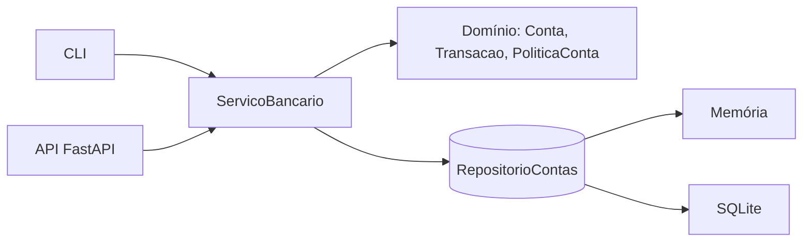

# 🏦 Sistema Bancário em Python

Sistema bancário com **depósito, saque e extrato**, focado em backend: núcleo de domínio testável, persistência plugável, **API REST com FastAPI** e uma **CLI** para uso no terminal.


## ✨ Funcionalidades

- **Abrir conta** com número sequencial e nome do titular
- **Depósito** de valores positivos
- **Saque** com limite por operação, limite diário e tarifa opcional
- **Extrato** com saldo, data/hora de cada movimentação e filtro por tipo
- Persistência em **SQLite** (arquivo) ou **memória** (testes)
- Duas interfaces sobre o mesmo núcleo: **API REST** e **CLI**

## 📏 Regras de negócio

| Regra | Padrão | Onde configurar |
|---|---|---|
| Depósito e saque só aceitam valores **> 0**, com no máximo **2 casas decimais** | — | `dominio/dinheiro.py` |
| Limite por saque | R$ 500,00 | `PoliticaConta.limite_por_saque` |
| Máximo de saques por dia | 3 | `PoliticaConta.limite_saques_diarios` |
| **Tarifa por saque** (monetização do banco) | R$ 0,00 | `PoliticaConta.tarifa_saque` |
| Saque não pode deixar a conta negativa (valor + tarifa ≤ saldo) | — | `Conta.sacar` |

Exemplo cobrando R$ 2,50 por saque:

```python
from decimal import Decimal
from banco.dominio import PoliticaConta
from banco.servicos import ServicoBancario

servico = ServicoBancario(repositorio, PoliticaConta(tarifa_saque=Decimal("2.50")))
```

## 🧱 Arquitetura



```
src/banco/
├── dominio/         # regras de negócio puras (sem I/O, sem framework)
│   ├── dinheiro.py  #   Decimal, validação e formatação em R$
│   ├── excecoes.py  #   erros de domínio
│   └── modelos.py   #   Conta, Transacao, PoliticaConta, Extrato
├── repositorios/    # contrato (Protocol) + implementações Memória e SQLite
├── servicos/        # casos de uso, com lock contra condição de corrida
├── api/             # FastAPI: rotas, schemas e tratamento de erros
├── apresentacao.py  # formatação do extrato para a CLI
└── cli.py           # menu interativo
tests/               # 90 testes: domínio, serviço, API e CLI
```

### Decisões de projeto

- **`Decimal` em vez de `float`**: `0.1 + 0.2 != 0.3` é inaceitável com dinheiro. Valores com mais de 2 casas são **rejeitados**, nunca arredondados em silêncio. Na API e no SQLite, valores trafegam/são gravados como texto decimal.
- **Validar antes de alterar**: `Conta.sacar` checa todas as regras antes de mexer no saldo, então uma operação recusada não deixa rastro.
- **Domínio separado da infraestrutura**: `dominio/` não conhece banco de dados nem HTTP. O serviço depende de um `Protocol` (`RepositorioContas`), então trocar SQLite por PostgreSQL/Azure SQL é criar uma nova implementação.
- **Concorrência**: o serviço serializa o ciclo *ler → alterar → salvar* com um lock; há testes com threads que garantem que saques simultâneos não furam o limite diário.
- **Relógio injetável**: o limite diário depende da data; os testes controlam o "agora" sem mocks.
- **Erros tipados**: cada regra violada é uma exceção (`SaldoInsuficienteError`, ...). A API traduz para HTTP (`404` conta inexistente, `422` regra violada) com `codigo` e `detalhe`.

## 🚀 Como executar

```bash
git clone <url-do-seu-repositorio>
cd sistema-bancario-python
python -m venv .venv
source .venv/bin/activate      # Windows: .venv\Scripts\activate
pip install -e ".[dev]"
```

### CLI

```bash
python -m banco.cli            # usa o arquivo banco.db
```

O valor aceita o formato brasileiro (`1.234,56`). Exemplo de extrato:

```
================= EXTRATO ==================
Conta 1 - Maria Silva
--------------------------------------------
29/09/2026 18:30  Depósito     + R$ 1.000,50
29/09/2026 18:30  Saque          - R$ 200,00
--------------------------------------------
Saldo: R$ 800,50
============================================
```

### API

```bash
uvicorn banco.api.app:criar_app --factory --reload
```

Documentação interativa em **http://127.0.0.1:8000/docs**. Para mudar o arquivo do banco: `BANCO_DB=outro.db`.

| Método | Rota | Descrição |
|---|---|---|
| `POST` | `/contas` | Abre uma conta |
| `GET` | `/contas/{numero}` | Consulta conta e saldo |
| `POST` | `/contas/{numero}/depositos` | Deposita |
| `POST` | `/contas/{numero}/saques` | Saca |
| `GET` | `/contas/{numero}/extrato?tipo=saque` | Extrato (filtro opcional: `deposito`, `saque`, `tarifa`) |
| `GET` | `/saude` | Health check |

```bash
curl -X POST localhost:8000/contas -H 'Content-Type: application/json' \
     -d '{"titular": "Maria Silva"}'

curl -X POST localhost:8000/contas/1/depositos -H 'Content-Type: application/json' \
     -d '{"valor": "1000.00"}'

curl -X POST localhost:8000/contas/1/saques -H 'Content-Type: application/json' \
     -d '{"valor": "600.00"}'
# 422 -> {"codigo":"LimiteSaqueExcedidoError","detalhe":"O limite por saque é R$ 500,00."}
```

## 🧪 Testes

```bash
pytest -q
```

Cobrem regras de domínio, precisão decimal, limites, tarifa, persistência em arquivo, concorrência (threads), rotas da API e fluxo da CLI. Os testes de serviço rodam contra **os dois repositórios** (memória e SQLite). O GitHub Actions executa a suíte em Python 3.10 e 3.12.

## 🔭 Próximos passos

- CPF do titular (com validação) e múltiplas contas por cliente
- Transferência entre contas (transação atômica)
- Autenticação (JWT) na API
- Migração para PostgreSQL / Azure SQL e deploy no Azure App Service
- Migrações com Alembic

## 📄 Licença

Projeto educacional desenvolvido no desafio de Python da [DIO](https://www.dio.me/).
